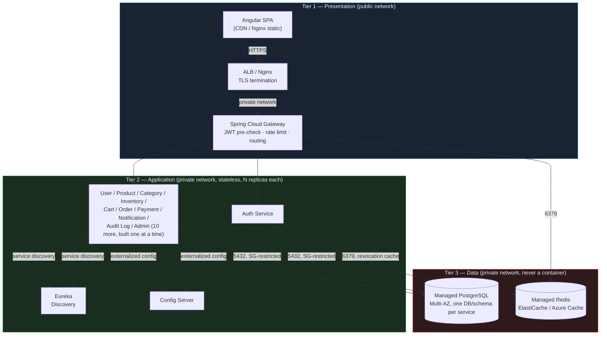

# ClickKart — Three-Tier Architecture

Status: living document. Reflects the locked architecture and the strict build order
(Eureka -> Config Server -> Gateway -> Auth Service -> 10 more business services, one at a
time, each gated by an explicit "confirmed deployable" from the project owner before the next
starts). As of this document, 4 of 14 services are built and deployed: Eureka Discovery
Server, Config Server, API Gateway, Auth Service.

## Why this document exists

A separate brief asked for a three-tier design with explicit constraints: no tier collapsing,
no database container in the application tier, no coupling the data tier's lifecycle to
Docker. Those constraints are compatible with what's already built, but not identical to the
convenience choices made so far in local dev - this document reconciles the two explicitly
rather than silently picking one.

---

## Diagram



No arrow crosses from Tier 1 into Tier 3 directly, and no Tier 2 box contains or owns a
database - the only things Tier 2 depends on in Tier 3 are reached over the network via a
security-group-restricted port, exactly like any external managed service.

---

## Tier 1 — Presentation

```
Internet
   |
   v
[ TLS-terminating ALB / Nginx reverse proxy ]  <- Tier 1 boundary starts here
   |            |
   |            v
   |     [ Static Angular build served via CDN/Nginx, no backend coupling ]
   v
[ Spring Cloud Gateway ]  <- internal, private-network only, no public IP
   |
   v
Tier 2 (below)
```

- **Static frontend**: Angular, built independently of any backend service, deployed to a CDN
  or a plain Nginx static-file container. It talks to the API only over HTTPS through the ALB
  - it is never on the same network segment as Tier 2.
- **ALB / Nginx (edge)**: terminates TLS. Everything behind it (Gateway, all microservices) is
  on a private network and reachable only from the edge and from each other - never a public
  IP, never `0.0.0.0/0` inbound.
- **Spring Cloud Gateway** (`clickkart-api-gateway`, already built) sits just inside that edge
  and does the things a generic ALB can't: local JWT signature pre-validation (rejects garbage
  tokens before they reach a service), Redis-backed rate limiting, and Eureka-based routing to
  the correct service instance. It is still "Tier 1" in the sense the brief means it - no
  business logic, no direct database access, no session state - it's a routing/edge component,
  not a microservice.
- No tier-1 component holds session state. Auth is stateless JWT end-to-end.

## Tier 2 — Application (Microservices)

### Service breakdown (full 14-service plan; build order is strict and gated)

| # | Service | Responsibility | Status |
|---|---------|-----------------|--------|
| 1 | Eureka Discovery Server | Service registry; every other service registers here and discovers peers by name instead of hardcoded host:port | Built |
| 2 | Config Server | Git-backed (`clickkart-config-repository`) externalized config, 4 profiles (dev/test/qa/prod) per service | Built |
| 3 | API Gateway | Routing, local JWT pre-validation, Redis rate limiting, correlation-ID forwarding | Built |
| 4 | Auth Service | Registration, login (email/mobile/publicId) and OTP login (SMS/email), JWT access+refresh issuance, RBAC role source of truth, logout/token revocation, account lockout, email/mobile verification, admin account listing/lock/unlock/soft-delete, tamper-evident (hash-chained) audit trail | Built |
| 5 | User Service | Customer/seller profile data beyond auth (addresses, preferences) | Not started |
| 6 | Product Service | Product catalog CRUD, search | Not started |
| 7 | Category Service | Category taxonomy | Not started |
| 8 | Inventory Service | Stock levels, optimistic-locked (`@Version`) stock decrement | Not started |
| 9 | Cart Service | Per-user cart state | Not started |
| 10 | Order Service | Order lifecycle, orchestrates Cart/Inventory/Payment | Not started |
| 11 | Payment Service | Payment processing/status | Not started |
| 12 | Notification Service | Email/SMS dispatch | Not started |
| 13 | Audit Log Service | Central audit trail - Auth Service already calls this via OpenFeign + Resilience4j, and treats it as a **required** dependency (register/login/etc. fail with 503 if it's unreachable, not degrade silently) | Not started |
| 14 | Admin Service | Administrative operations across the platform | Not started |

Every service:
- Is its own Spring Boot 4.x app, own Maven module/repo, own Dockerfile, own database/schema.
- Validates JWTs and enforces RBAC itself via Spring Security - the Gateway's pre-check is a
  cheap first filter, not the authorization boundary. A service reachable directly (bypassing
  the Gateway, e.g. in a pentest) must reject an invalid/expired/revoked token on its own.
- Is stateless: no local file storage, no in-memory HTTP session, nothing written to the
  container's filesystem that isn't disposable log output. Anything that must survive a
  restart lives in Tier 3.
- Communicates synchronously over REST via OpenFeign (with Resilience4j circuit breakers) for
  the current 4 services. **Kafka/RabbitMQ is reserved for the async, high-fan-out paths that
  don't exist yet** - specifically Order Service publishing order-placed events for Inventory,
  Notification, and Audit Log to consume independently, once those services exist. Until then,
  REST/Feign is the only inter-service transport in the codebase; introducing a broker before
  there's a real async use case would be unused infrastructure.
- Exposes `/actuator/health` for readiness/liveness and runs as a non-root container user
  (already true for all 4 built services - see each service's Dockerfile).
- Can run N replicas with zero coordination: replicas share nothing locally, register
  independently with Eureka, and read config from the Config Server - a second replica needs
  no state transferred from the first.

### No database container in this tier

This is the point of friction with current local-dev practice, made explicit rather than
glossed over: each service's own `docker/docker-compose.yml` (built earlier) bundles a
`postgres:16-alpine` container for **inner-loop developer convenience** - `docker compose up`
and you have a working stack with zero external dependencies. That pattern still exists and is
unchanged; it is not what ships.

For the application tier specifically - the artifact this brief asks for -
[`docker-compose.app-tier.yml`](../../docker-compose.app-tier.yml) at the repo root contains
**only** the 4 Spring Boot services. No Postgres. No stateful volume. Each service's DB
connection string is supplied via required environment variables with no default
(`${AUTH_DB_HOST:?...}` etc.) pointing at an external endpoint - exactly the pattern
`clickkart-auth-service-prod.properties` in the config repo already uses (`DB_HOST` has no
fallback in prod/qa/test; only `dev` has a `localhost` fallback, and even that is a named,
documented exception for local convenience per the project's own secrets rule).

To actually run the app tier locally against something, you need a Tier-3 stand-in.
[`docker-compose.dev-infra.yml`](../../docker-compose.dev-infra.yml) provides one - it's
deliberately **not** part of the application tier compose file, is labeled as a Tier-3
substitute, and is the only place Postgres/Redis containers are allowed to appear.

## Tier 3 — Data

- **Managed PostgreSQL** (RDS / Azure Database for PostgreSQL / equivalent), one database (or
  schema) per microservice, Multi-AZ with automated failover, automated backups + PITR enabled
  at the managed-service level. Never a container. Never something Docker Compose starts,
  stops, or owns the volume for in staging/prod.
- **Network isolation**: the DB security group allows inbound 5432 only from the application
  tier's security group (or equivalent - VPC peering / private subnet routing). No public IP,
  no `0.0.0.0/0`, ever.
- **Redis** (rate-limit counters in Gateway, revoked-JWT-jti cache in Auth Service) is
  ephemeral cache state, not the system of record, so it's treated as tier-2-adjacent
  infrastructure rather than Tier 3 proper - but the same principle still applies: in
  staging/prod it must be a managed cache (ElastiCache / Azure Cache for Redis), reached via
  `REDIS_HOST`/`REDIS_PORT` env vars with no baked-in default, not a container the app tier
  owns the lifecycle of. Losing the cache should degrade rate limiting/revocation-check latency,
  never lose data that matters.
- **Per-service isolation**: every one of the 14 planned services gets its own
  database/schema. None currently need a fully separate *database instance* (as opposed to
  schema) - flagging this to revisit if Order/Payment Service's compliance or throughput
  requirements later justify physical instance isolation.

---

---

## Cross-cutting

### CI/CD

[`Jenkinsfile.template`](../../Jenkinsfile.template) is the canonical declarative pipeline:
checkout -> build -> unit test (JUnit 5/Mockito, published via the `junit` step) -> Docker
build -> Trivy image scan (fails on CRITICAL/HIGH) -> push to registry (main/release branches
only) -> manual approval gate for `prod` -> `kubectl set image` deploy -> smoke test against
`/actuator/health`. Rollback is a documented, deliberately-manual `kubectl rollout undo`
(printed in the `post { failure }` block) rather than an automatic revert, so a bad rollout
gets a human look instead of silently masking itself.

Per the "no shared library" rule extended to CI: there's no Jenkins shared library repo - each
service copies the template into its own root as `Jenkinsfile`.
[`clickkart-auth-service/Jenkinsfile`](../../clickkart-auth-service/Jenkinsfile) is the first
real instance.

### Secrets

Already true for every built service, not a new practice this doc introduces: every
credential (DB password, JWT secret, admin Basic Auth password, Config Server password) is
`${VAR:?must be set}` in prod/qa/test config-repo profiles - no default, fails fast at startup
if a secret wasn't actually injected. Only `dev` profiles carry a clearly-labeled
`dev-only-secret-change-me` fallback for local convenience. In the sample K8s manifests
(`k8s/auth-service/deployment.yaml`), secret values are shown as `REPLACED_BY_SECRETS_MANAGER`
placeholders - real values are synced in by a secrets-manager integration (External Secrets
Operator / AWS Secrets Manager / Vault), never `kubectl apply`'d with literal values or
committed to any repo.

### Observability

Per the already-locked architecture: **Prometheus + Grafana** for metrics, **ELK**
(Elasticsearch/Logstash/Kibana) for centralized structured logs.

- Every service exposes `/actuator/health` (liveness/readiness split via
  `management.endpoint.health.probes.enabled`) and `/actuator/prometheus` (via
  `micrometer-registry-prometheus`) for scraping.
- Structured logging is already in place for Auth Service (`logback-spring.xml` - separate
  APPLICATION/ERROR/AUDIT/SECURITY/SQL/ACCESS appenders, async, size+time rotation) and is the
  pattern to replicate per service; a Logstash/Filebeat sidecar or DaemonSet ships those log
  files to the ELK stack rather than each service talking to Elasticsearch directly.
- Every log line already carries the request's correlation ID via MDC
  (`%X{correlationId}` in the console pattern) - this is what makes a single request traceable
  across services in Kibana without a full distributed-tracing system.

### Config

Already fully externalized: Spring Cloud Config Server, git-backed
(`clickkart-config-repository`), 4 profiles per service (dev/test/qa/prod), zero
environment-specific values hardcoded in any `application.properties` - confirmed by
inspection of every profile file for all 4 built services.

---

## Tier-boundary confirmation checklist

- [x] Tier 1 has no business logic, no DB access, no session state (static frontend + ALB +
      Gateway routing only).
- [x] Tier 2's application-tier compose/manifests define zero database containers - confirmed
      by inspection of `docker-compose.app-tier.yml` below.
- [x] Tier 2 services are stateless - no named volumes for anything but disposable logs.
- [x] Tier 3 is never started/stopped/owned by Docker Compose in staging/prod - only the
      explicitly-labeled `docker-compose.dev-infra.yml` touches a DB container, and only for
      local development.
- [x] DB connection strings are 100% environment-variable-sourced, no hardcoded values,
      already true in every profile file in `clickkart-config-repository`.
